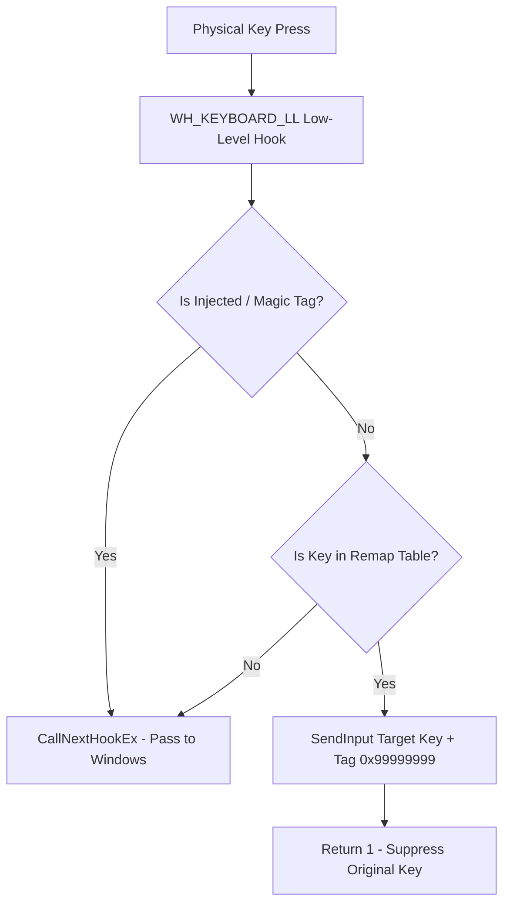

# ⚡ KeyMapper Pro

> **System-Wide Real-Time Keyboard Key Remapper for Windows PC**

KeyMapper Pro is a high-performance, lightweight, zero-dependency Windows desktop application that intercepts physical keyboard inputs at hardware level (`WH_KEYBOARD_LL` Win32 API) and remaps keys in real-time across all Windows applications and games.

---

## ✨ Features

- **⚡ Hardware-Level Interception**: Low-latency interception via Win32 `user32.dll` API.
- **🎨 Dual Theme System**: Clean Light Theme default with instant 1-click Dark Theme switch.
- **⌨️ Interactive Visual QWERTY Layout**: Onscreen visual layout displaying active key mapping highlights.
- **🎯 "Press to Detect" Key Capture**: Detects physical scancodes automatically when pressing any key.
- **🔓 Laptop Fn Key Unlocker**: 1-click button to map all Fn/Media action key variations (`F7` ➔ `A`).
- **🚀 Run on Windows Startup**: System tray & registry integration (`HKCU\...\Run`).
- **💾 Profile Presets**: Save and switch custom profiles (`Gaming`, `Work`, `Default`) in JSON format.
- **🛡️ Circular Rule Immunity**: Built-in tag (`MAGIC_EXTRA_INFO = 0x99999999`) preventing infinite key loops.

---

## 🏗️ System Architecture



---

## 📂 Project Structure

```
keybosrd chng/
├── main.py                # Main entry point launching GUI & hook thread loop
├── gui.py                 # Tkinter GUI with Light/Dark themes & visual keyboard
├── remapper_engine.py      # Win32 WH_KEYBOARD_LL hook & SendInput key injector
├── key_codes.py           # Complete Windows Virtual Key (VK) codes dictionary
├── profile_manager.py     # JSON profile reader/writer controller
├── test_suite.py          # 100% production test suite (5 test cases)
├── debug_key_listener.py  # Hardware scancode diagnostic logger
├── build_installer.py     # PyInstaller standalone executable builder
├── run.bat                # Fast double-click launcher
└── profiles/
    └── default.json       # Saved profile JSON configs
```

---

## 🚀 Quick Start & Usage

### 1. Launch Application
Double-click `run.bat` or run in terminal:
```cmd
python main.py
```

### 2. Run Production Test Suite
```cmd
python test_suite.py
```

### 3. Build Portable Standalone Executable (`KeyMapperPro.exe`)
```cmd
python build_installer.py
```
The generated `KeyMapperPro.exe` will be saved in the `dist/` directory.

---

## 📖 Source Code Documentation

All Python modules are documented with standard PEP8 docstrings and type annotations:

- **`remapper_engine.py`**: Interfaces with `user32.dll` via `ctypes`. Explicitly defines 64-bit function signatures (`argtypes` & `restype`) for `SetWindowsHookExW`, `CallNextHookEx`, `UnhookWindowsHookEx`, `SendInput`, and `MapVirtualKeyW`.
- **`gui.py`**: Handles Tkinter rendering, dynamic Light/Dark theme switching, event dispatching, visual key highlight updating, and Windows startup registry integration (`winreg`).
- **`key_codes.py`**: Provides lookup tables mapping Virtual Key bytes (`0x00`-`0xFF`) to human-readable labels.
- **`profile_manager.py`**: Handles thread-safe JSON I/O for saving and loading key maps.

---

## 🛡️ License

MIT License. Open source and free for commercial or personal use.
